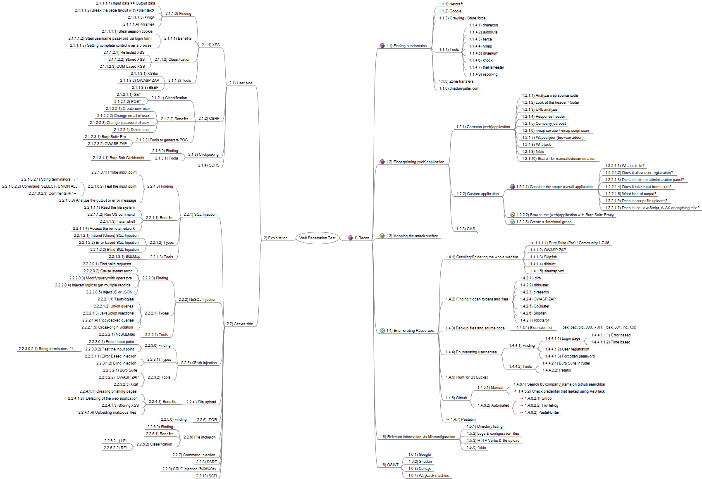

# MindMap
Some mindmaps
-----
## AD penetration testing Mindmap
The famous AD penetration testing mind map of Orange Cyberdefense made by mayfly (@M4yFly), viking (@Vikingfr) and Sat0rryu (@Sant0rryu) is high in my favorites. I regularly use the mind map to view a certain scenario and command. Unfortunately it is not possible to copy the text from the SVG file. Sometimes to great frustration that I have to retype it and make a typing error. For several months now I have been restructuring my notes from Joplin to Obsidian. While working with Obsidian I found out that you can make a mind map (canvas) and then copy commands. A good time to convert the AD mind map to something I can copy and paste from. Of course I also want to share this with you. If there are things in it that are not correct, or something is missing. Then let me know and I can update it.

[Direct link to the Mindmap (canvas)](https://github.com/eMVee-NL/MindMap/blob/main/AD%20Mindmap/Mindmap%20AD.canvas)

-----
## Privilege escalation mindmap
Now that I'm updating my cheat sheet, I like to also make mind maps that I put at the beginning of my category. I use this as a reference. In this case I have divided the Privilege escalation mindmaps between Linux and Windows. I am still developing this one.

The mindmap for **Linux**. [Direct link](https://github.com/eMVee-NL/MindMap/blob/main/Privilege%20escalation%20Mindmap/00%20Mindmap%20Linux%20Privilege%20Escalation.canvas)

The mindmap for **Windows**. [Direct link](https://github.com/eMVee-NL/MindMap/blob/main/Privilege%20escalation%20Mindmap/00%20Mindmap%20Windows%20Privilege%20Escalation.canvas)

-----
## Web Penetration Testing Mindmap
I've created this mindmap for web penetration testing. I started with this mindmap during the eWPT course and I've updated it with some other techniques.
This is something that should be updated regulary in the near future. The mindmap is created with **Freemind** and can be found here: https://github.com/eMVee-NL/MindMap/blob/main/Web%20Penetration%20Testing%20Mindmap/Web-Penetration-Testing-Mindmap.mm

